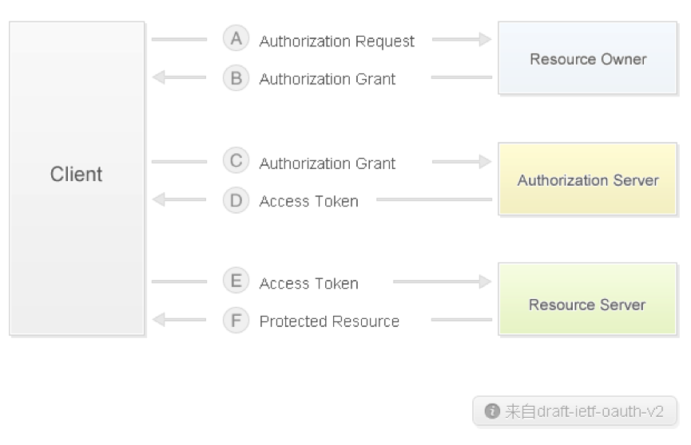

  本文档除有特别说明外，数据传输都使用get方式发送，返回数据一律使用json格式。
接口返回的 json 数据会根据业务情况进行增加，客户端不应假定json 数据中返回的对象数据个数。

Oauth2.0 授权流程图

目前仅实现并提供站内应用接入、登录接入、订单创建等相关功能，暂未上线Oauth2.0 登录授权页功能。
以上流程图中

Client ： 即本文档所称的第三方开发者

Resource Owner : 即平台的注册用户

Authorization Server 和 Resource Server 目前均指开发者平台，即这些服务都由开发者平台服务器提供服务。

返回数据中的各种key名称，除非特别说明，默认均为小写。

以下接口中相关实现都基于默认已登录并授权访问。

###签名规则（通用）

签名规则适应用于所有需要进行签名验证的接口。

在请求参数列表中，除去sign参数外，其他需要使用到的参数都是要签名的参数。

对参数按a-z的顺序进行排序，然后使用&符号，将需要签名的数据按照key=val的形式连接起来最后附加上app_secret的值，示例URL：

`https://passport.cocos.com/oauth/token/?client_id=103&app_key=aeb09dcb8e1eab0d1306625b268d5e2a&grant_type=password&password=111111&username=hhhhhh@chukong-inc.com&sign=1f04f8520ce4808761aa4fc1ad04e838`

该URL生成的签名字符串前面部分为：

`app_key=aeb09dcb8e1eab0d1306625b268d5e2a&client_id=103&grant_type=password&password=111111&username=hhhhhh@chukong-inc.com`

假设其app_secret为：

`090efb8c3d3a6107b59202f765f18343`

那么查询字符串连接app_secret后生成的字符串为：

`app_key=aeb09dcb8e1eab0d1306625b268d5e2a&client_id=103&grant_type=password&password=111111&username=hhhhhh@chukong-inc.com090efb8c3d3a6107b59202f765f18343`

通过md5后生成最终的签名字符串为：

`1f04f8520ce4808761aa4fc1ad04e838`

参考

`
  function make_sign($arr, $secret) {
       ksort($arr);
       $res = '';
        foreach ($arr as $key => $value) {
            $res.=$key .'='. $value;
        }
        $res .= $secret;

        return strtoupper(MD5($res));
    }
    
  `

注意：

__1. 关于签名字符串，最后生成的应用都是小写。__

__2. 待签名的字符串值应当是没有进行过URL Ecodeing的原值，而且传输的过种中，如果参数中含有特殊字符，如@、&之类的，在传输的时候，需要进行URL Ecodeing操作。__

__3. 生成签名字符串必须是所有除sign本身以外的其它所有参数，即使其值为空。__

###站内应用接入

示例：

`http://cn.cocos.com/demo/play?app_id=613934525&app_key=4e62a8e22db0fe0a5e2db487ba4282a9&app_platform=1&create=1412818164&expire=1412904564&session=849a0a464212d4b624e0de7b52d1c943&uid=400053&sign=5c64367fb7d181a7a592c3521da6322f`

(注：以上地址目录不可访问，仅做URL展示示例)

传入第三方应用的参数

| 参数名称 | 是否必须 | 参数解释说明|
|----|----|----|
|app_id|必须|开发者的应用ID|
|app_key	|必须|第三方应用的app_key|
|create	|必须|session开始时间|
|expire	|必须|session过期时间|
|session	|必须|session值|
|uid	|必须|开发者的UID|
|app_platform	|必须|应用平台(1:ios,2:andriod)|
|sign	|必须|数据签名|

第三方应用需要自行实现该接口的接入，以上参数会提交给第三方url（该url在开通应用时需要给开发者平台提供），验证数据签名是否正确，以及使用oauth相关接口及时刷新session状态。

###获取访问token

本接口用于获取一个经过授权的访问令牌，以便于后续访问用户的相关资源

接口地址：

`https://passport.cocos.com/oauth2/access_token`

上传参数：

| 参数名称 | 参数解释说明|
|----|----|
|code	|即本文档中“2.站内应用接入”接口中传递的session值，该接口只在第一次调用有效|
|grant_type	|authorization_code|
|sign	|数据签名|

返回数据（JSON）：

| 参数名称 | 参数解释说明 |
|----|----|
|access_token	 | 访问令牌，接下来的每次访问都需要使用。|
|refresh_token | 	刷新令牌（在访问令牌过期后，执行“刷新访问令牌”操作时使用，每次刷新访问令牌会同步更新刷新令牌）|
|expires_in | 	访问信息过期时间（单位秒）|
|scope | 	权限（暂未使用，默认为basic）|

###刷新访问token 

在“3.获取访问token”接口中的‘访问令牌’过期后，执行本操作刷新访问领牌，会颁发新的访问令牌和刷新令牌以延长访问授权周期，如果刷新令牌也已经过期，则需要重新登录。

接口地址：

`https://passport.cocos.com/oauth2/access_token`

上传参数：

| 参数名称 | 参数解释说明 |
|----|----|
|uid | 用户ID|
|refresh_token	|刷新令牌(第二步获取到的刷新令牌)|
|grant_type	| refresh_token |
|sign|	数据签名 |

返回数据：

同“`获取访问token`”

###第三方服务开通通知 

本接口用于标识开发者游戏应用的第三方服务开通状态

接口地址：

`https://passport.cocos.com/app/service?app_id=`

上传参数

| 参数名称 | 参数解释说明|
|----|----|
|access_token	|用户访问令牌|
|app_id	|app_id|
|sign	|数据签名|

返回参数：

| 参数名称 | 参数解释说明|
|----|----|
|status	|1|
|info	|服务开通成功|
|data |	JSON格式数据|

###推送通知消息 

本接口用于第三方服务向指定的用户推送消息、通知（前台暂未显示消息通知，后期开放）

接口地址：

`https://passport.cocos.com/message/push`

上传参数：

| 参数名称 | 参数解释说明|
|----|----|
|uid	|通知到的用户ID|
|title	|标题|
|content	|内容|
|objid	|发送对象的ID|
|expire	|过期时间|
|client_id	|第三方服务ID|
|sign	|数据签名|

返回参数：

返回通用成功信息或者失败信息

###第三方订单状态更新接口（第三方开发）

开发者平台通知第三方订单状态变更接口，由第三方开发的，并提供给开发者平台。

上传参数:

|参数名|	参数说明|
|----|----|
|notify_id	|通知校验ID。用于调用通知来源校验接口，以确认通知来自开发者平台。|
|order_id	|第三方订单号|
|order_status	|订单状态	|

订单状态说明

|参数名称| 参数解释说明|
|----|----|
|0	|等待支付|
|1	|支付成功，等待发货|
|3	|已取消|
|4	|已申请退款|
|5	|退款成功|
|6	|退款失败|

成功返回参数：

| 参数名称 | 参数解释说明|
|----|----|
|status	|状态码|
|info	|返回信息|

返回参数说明：

|status|info	|返回信息说明|
|----|----|----|
|1	|订单状态更新成功| 	第三方订单状态处理成功|
|2	|订单状态更新失败|	第三方订单状态处理失败|

成功示例：

``{"status":1,"info":" \u8ba2\u5355\u72b6\u6001\u66f4\u65b0\u6210\u529f "}``

失败示例：

``{"status":2,"info":" \u8ba2\u5355\u72b6\u6001\u66f4\u65b0\u5931\u8d25 "}``

###通知来源校验

通过notify_id确认通知来自开发者平台

接口地址：

`https://passport.cocos.com/order/verify_notify`

上传参数:

|参数名	|参数说明|
|----|----|
|notify_id	|通知校验ID|
|app_key	|第三方应用的app_key |
|sign	|数据签名|

成功返回参数：

| 参数名称 | 参数解释说明|
|----|----|
|status	|状态码|
|info	|返回信息|
|data	|返回数据|

返回参数说明：

|status	|info	|返回信息说明	|data|
|----|----|----|----|
|1	|true|	notify_id验证正确	|空|
|2	|false|	notify_id验证错误	|空|

成功示例：

``{"status":1,"info":"true","data":""}``

失败示例：

``{"status":2,"info":" false","data":""}``

###订单创建

本接口用于APP订单创建。

接口地址：

`https://passport.cocos.com/order/create`

上传参数：

|参数名	|参数说明|
|----|----|
|app_key|	第三方应用的app_key 。|
|sign	|数据签名。|
|order_id|	订单ID号。数字或字母组成，最长50位。|
|user_id	|购买用户的ID号，帐号必须为激活状态。|
|app_id	|开发者的应用ID|
|product_name	|产品名称。最长100位。|
|product_id	|产品 ID。数字或字母，最长32位。|
|product_desc|	产品描述。最长255位。|
|product_price|	产品单价。正整数或小数，整数部分最长6位，小数点后最多2位。|
|buy_cnt|	购买数量。正整数，最长3位。|

成功示例：

``{"status":1,"info":"\u8ba2\u5355\u521b\u5efa\u6210\u529f","data":" COCOS02000591691D05A32 "}``

失败示例：

``{"error":"invalid_grant","error_description":"\u7528\u6237\u5df2\u5b58\u5728","error_code":20501,"error_uri":""}``

10.	订单状态更新（向开发者平台通知订单状态）

本接口用于通知订单发生变化。

接口地址：

`https://passport.cocos.com/order/update_status`

上传参数：

|参数名	|参数说明|
|----|----|
|app_key	|第三方应用的app_key |
|sign	|数据签名|
|order_id	|订单ID号|
|order_status	|订单状态|

订单状态说明

|参数名	|参数说明|
|----|----|
|2	|已发货/购买成功|
|5	|退款成功|
|8	|订单取消成功/同意退款|
|9	|订单取消失败/不同意退款|

返回参数：

返回通用成功信息或错误信息

成功示例：

``{"status":1,"info":" \u8ba2\u5355\u72b6\u6001\u66f4\u65b0\u6210\u529f ","data":""}``

失败示例：

``{"error":"invalid_grant","error_description":"\u7528\u6237\u5df2\u5b58\u5728","error_code":20502,"error_uri":""}``

###JS API接口

JS API文件地址：

`https:// passport.cocos.com/static/js/api.js`

用户在第三方应用中执行购买操作，第三方应用通知开发者平台用户需要支付的JS接口。调用此方法后，开发者平台将跳转到指定订单的支付页面。

方法：API.payOrder(order_id);

参数说明：

order_id	第三方订单号。

注：该接口用于本文档第9条，订单创建成功后，跳转至支付页面。

###通用成功信息

部分操作，操作成功后，接口会返回一个通用的操作成功信息，以便通知客户端，本次操作已完成，一般情况下无特别数据返回，个别情况下，会需要返回数据，这些数据在返回的data 键中，以数组形式返回。

返回参数：

|参数名	|参数说明|
|----|----|
|status	|固定值1（通知来源校验接口例外）|
|info	|'操作成功'|
|data	|''|

例：

``{"status":1,"info":"\u8ba2\u5355\u521b\u5efa\u6210\u529f","data":" COCOS02000591691D05A32 "}``

###错误信息
 
如下类似的（包含有任何error 数据的json对象，都表示服务端判断提示出错）：

|参数名	|参数说明|
|----|----|
|"error"	|"invalid_request",    //错误标识|
|"error_description"	|"无效请求，参数类型或值错误。", //错误中文提示内容|
|"error_code"	|20001,  //错误代码，java或其它客户端取值时注意，该值为 int 型，其它key通常都为string 型|
|"error_uri"	|错误说明URL （暂未开放）|

例：

``{"error":"invalid_grant","error_description":"Token\u4e0d\u5b58\u5728\u6216\u5df2\u8fc7\u671f\u3002","error_code":20017,"error_uri":""}``
以上json进行解析成为数组后为：

``
Array
(
    [error] => invalid_grant
    [error_description] => Token不存在或已过期。
    [error_code] => 20017
    [error_uri] => 
)
``

###错误代码列表

API用户相关：

|返回错误信息	|参数说明|
|----|----|
|20001| 'Uid参数为空'|
|20002| '用户不存在'|
|20003| '用户已存在'|
|20004| '用户密码匹配失败'|
|20005| '用户密码修改失败'|
|20006| '用户帐号未激活。'|
|20007| '用户名或密码错误。'|
|20008| '帐号激活失败'|
|20009| '帐号已经激活过了'|
|20010| 'Email长度为6至60位'|
|20011| 'Email格式错误'|
|20012| '密码只能为数字、字母、半角标点符号'|
|20013| '昵称长度为3至20位'|
|20014| '帐号注册失败'|
|20015| '密码长度为6到16位'|
|20016| '密码修改失败'|
|20017| '密码修改Token不存在或已过期'|
|20018| '要修改的用户与Token中信息不匹配'|

API App相关：

|返回错误信息	|参数说明|
|----|----|
|20101 | App_id参数为空|
|20102 | 应用不存在|
|20103 | 该服务已经开通过了|
|20104 | 服务开通操作失败|

API 消息相关：

|返回错误信息	|参数说明|
|----|----|
|20201  |  标题为空|
|20202  |  内容为空|
|20203  |  输入文字太长，请确认不超过XX个字符|
|20204  |  输入文字太长，请确认不超过XX个字符|
|20205  |  消息推送失败|

API 系统相关：

|返回错误信息	|参数说明|
|----|----|
|20301  |  频繁请求，暂停使用服务一段时间|
|20302  |  签名验证失败|
|20303  |  参数错误|

Oauth授权相关：

|返回错误信息	|参数说明|
|----|----|
|20401  |  授权失败，令牌已过期。|
|20402  |  未知错误，无效请求。|
|20403  |  无效授权。|
|20404  |  授权许可类型不被授权服务器支持。|
|20405  |  无效授权，用户信息不存在！|
|20406  |  授权客户端不存在。	|
|20407  |  当前服务授权未开通或已被关闭。|
|20408  |  刷新令牌已过期或不存在。|

订单相关：

|返回错误信息	|参数说明|
|----|----|
|20501 |	订单号无效。|
|20502	|订单状态无效。|
|20503	|订单创建失败。|
|20504	|订单状态更新失败。|
|20505	|购买用户的ID无效。|
|20506	|产品ID无效。|
|20507	|产品名称无效。|
|20508	|产品描述无效。|
|20509	|产品单价无效。|
|20510	|购买数量无效。|
|20511	|APP ID无效|

