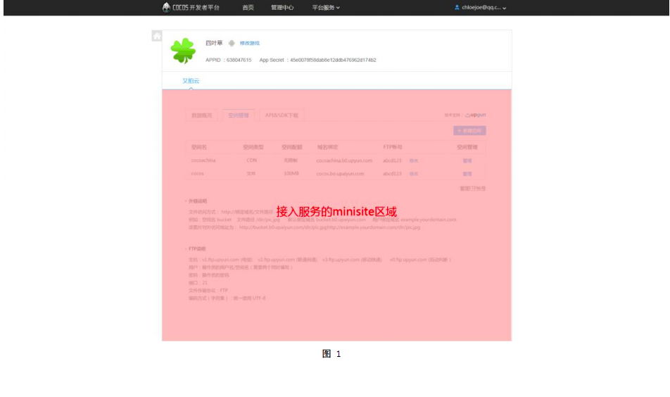
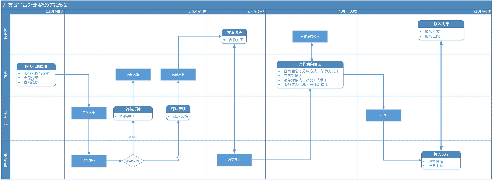
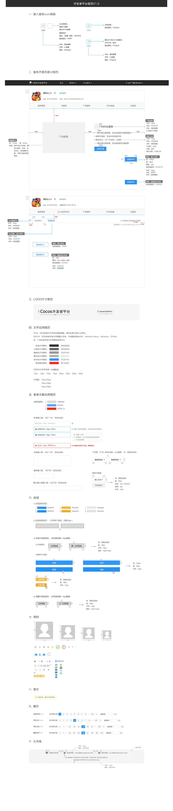

##平台介绍

Cocos 开发者平台（后续简称：平台）目标整合多种价值服务，帮助游戏开发者实现登录支付、渠道打包、运营、运维等游戏开发运营环节中的重要功
能管理。

##接入说明

- 服务提供商必须提供包含核心服务功能的页面（后续简称：minisite，示例可参见图 1），由Cocos开发者平台以iframe的形式嵌入在平台内展示

- 为保证服务提供商的服务正常被平台开发者使用，平台将够提供一整套接口，包括服务内嵌、授权登录、服务开通、支付、通知等，帮助服务提供
商管理用户与游戏信息，服务提供商必须按照合同约定使用相关API接口。

##Minisite示例：##

##服务接入流程

在确定接入意向后，需经历如图 2 所示步骤

__图2__

##接入流程具体说明

###第一步：接入申请

1) 该流程由服务提供方发起，通过商务告知开发者平台产品团队

2) 准备并提交申请信息，申请信息详见表 1，请发送邮件至商务对接人，抄送 g-3rdservice@chukong-inc.com；

|填写内容| 说明|
|------|------|
|服务名称| 例如：摩羯推送。长度限制为 6 个汉字以内，显示在 Cocos 开发者平台|
|服务类型| 推送、地图、游戏引擎、社交分享、即时通讯、支付平台、应用加密、服务类 API、云存储、云测试、云服务器、
云数据库、云监控、其他运维、快速开发、推广、营销策略、第三方登录、人脸识别|
|服务介绍| 请描述服务的主要功能、是否能为开发者带来收益|
|服务是否付费| 是 或 否|
|公司名称| 例如：北京触控科技有限公司|
|网站域名| 例如：http://cn.cocos.com|
|项目接口人| 例如：张三|
|联系邮箱| 例如：nannan.xie@chukong-in.com|
|手机| 例如：185 1323 4600|

###第二步：服务评估

1) 平台收到申请资料将在 5 个工作日内反馈结果；

2) 审核通过后，将发送 API 文档、UI 规范及接入流程说明至联系邮箱。

###第三步：方案评估

1) 服务方提供完整的接入服务产品需求文档（含原型），即 minisite 设计方案；

2) 平台根据需求文档与服务方沟通确认方案。

###第四步：意向达成 

1) 当接入方案确定，双方达成合作意向，将由平台 BD 与服务提供方签订合作协议；

2) 合作协议需包含：双方权利及义务，约束条款及具体分成方式、结算方式等信息

###第五步：确定排期 

合同签订后，服务提供方需尽快提供自己的项目排期与联调计划，反馈至商务，方便平台提前安排联调资源；

###第六步：产品研发

1) 服务方根据确定的方案进行研发；

2) 接入平台相关的内容，具体请查看《Cocos 开发者平台接口说明文档》。

###第七步：联调上线 

1) 根据排期计划，需根据平台 UI 规范进行设计；同时服务提供方进行服务功能的 minisite 开发；

2) Minisite 开发完成后，需同步平台确认 UI 风格与功能

3) 具体联调测试前，服务提供方需提交：minisite 网址、minisite 高度（最大 1000px）、服务 icon（启用，禁用两个状态），由平台提供沙箱测试环
境，方便服务提供方进行测试。

4) 服务提供方进行联调测试

5) 服务提供方测试通过后，可进行 minisite 页面发布，并通知平台进行产品验收

6) 平台验收通过，通知服务提供方确认正式环境中的上架信息，如表 2 所示

|填写内容 |说明|
|----|----|
|minisite 网址 |如：http://www.cocos.com|
|minisite 高度 |如：1000px|
|服务图标 |分为点亮状态和未点亮状态两种，具体请参考 UI 设计规范|
__表2__

UI 设计规范

7) 确认无误后，由平台完成服务上架展示操作。

##补充说明：特殊情况预警和通知

1. 正式上线后，若发现无法正常使用等情况，平台有权利在第一时间将服务下线并告知联系人，待问题解决后，重新上线；

2. 若第三方服务产品发生变更或出现问题需要临时下线时，请务必提前与平台联络，平台将配合做相应措施；

3. 如第三方服务提供商有相关运营推广需求也请提前告知，平台可以关注数据变化，配合提供相关资源等。

